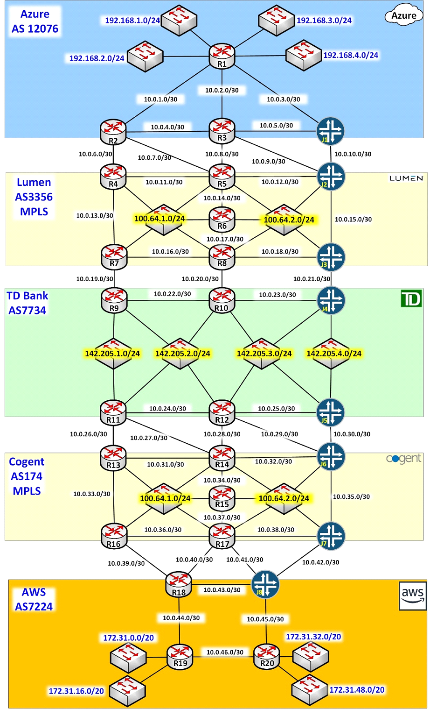

# MPLS-Simulation
This repo contains config files, images and detailed outlines of how to configure an MPLS circuit.
This simulation will be carried out in GNS3

## Description of simulated scenario 

⦁	TD Bank has an On-Premises datacentre with the subnets 142.205.1.0/24, 142.205.2.0/24, 142.205.3.0/24, and 142.205.4.0/24.  
⦁	TD Bank has also resources in the cloud, both in Azure and AWS.  
⦁	TD Bank has direct connect style MPLS tunnels to Azure and AWS.  
    ⦁	Lumen provides the MPLS transport to Azure.  
    ⦁	Cogent provides the MPLS transport to AWS.  
⦁	Any computing resource connected to TD’s networks (142.205.1.0/24, 142.205.2.0/24, 142.205.3.0/24, and 142.205.4.0/24) must have connectivity with the compute resources in Azure and AWS.  
⦁	The TD compute resources located in the two cloud providers must have mutual access for replication purposes.  
⦁	All autonomous system networks run an underlying IGP which will be OSPF.   
⦁	R1,R19 and R20 should have default routes that point towards the CE routers. The CE routers should advertise an default route using the routing protocol OSPF.  
    ⦁ The PE routers that connect to the cloud networks should also advertise a default route through BGP.   
⦁	The Service providers networks will use VRFs (Virtual routing and forwarding) to seperate each traffic.   

### GNS3 topology image 

image.png
image.png
image.png
